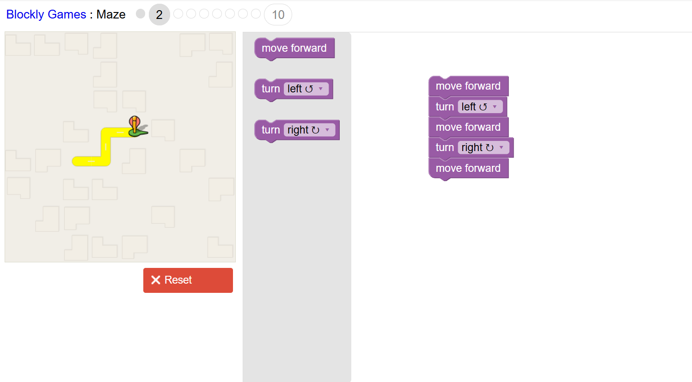
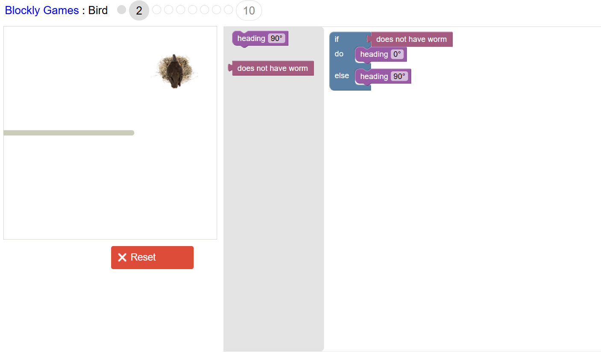
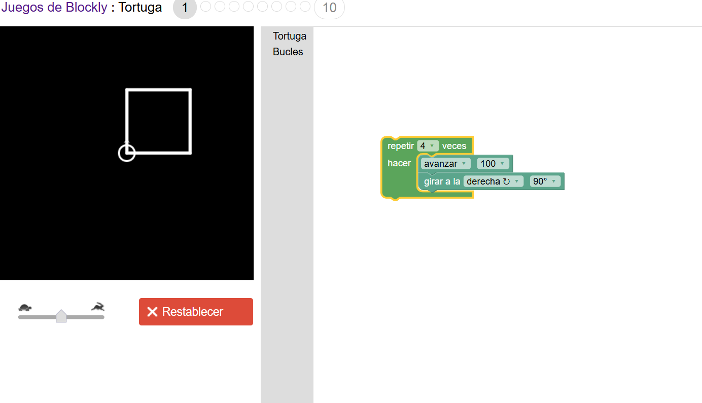
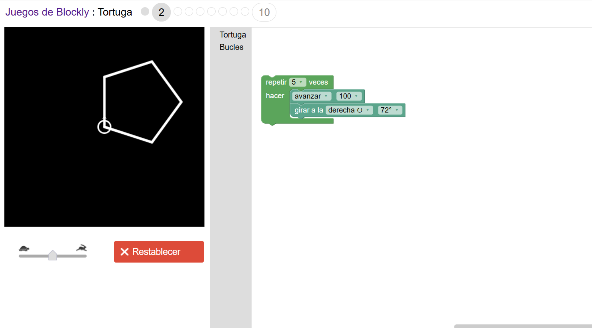

<a href="../Unidad1" style="
    background: linear-gradient(90deg, #2E7D32, #66BB6A);
    color: white;
    padding: 12px 30px;
    text-decoration: none;
    font-size: 18px;
    font-weight: bold;
    border-radius: 10px;
    box-shadow: 0 4px 10px rgba(0,0,0,0.2);
    display: inline-block;
    margin-top: 20px;
">
⬅️ Volver al Índice
</a>

---

# 💻 Programación por Bloques

En esta sección se muestran las actividades realizadas en **Blockly Games**, con su descripción detallada y los diagramas de bloques correspondientes.  
[Visitar Blockly Games](https://blockly.games/)

---

## 🔹 Actividad 1 — Maze (Nivel 2)

**Descripción detallada:**  
En esta actividad, el jugador debe programar un personaje (figura verde) para recorrer un laberinto y llegar a su objetivo.  

**Bloques utilizados:**  
- `move forward`: mueve al personaje hacia adelante.  
- `turn left`: gira a la izquierda.  
- `turn right`: gira a la derecha.  

**Funcionamiento del programa:**  
1. El personaje se mueve hacia adelante con `move forward`.  
2. Gira a la izquierda con `turn left`.  
3. Avanza otra vez con `move forward`.  
4. Gira a la derecha con `turn right`.  
5. Se mueve adelante para llegar al destino.  

**Aprendizaje clave:**  
Desarrollar el pensamiento lógico secuencial, planificando pasos precisos para alcanzar un objetivo usando bloques de movimiento y giros.  

**Diagrama de bloques:**  

**IMAGEN 8:** Diagrama de bloques de la Actividad 1 — Maze (Nivel 2).  

---

## 🔹 Actividad 2 — Bird (Nivel 2)

**Descripción detallada:**  
Programar el movimiento de un ave para que busque y recoja el gusano (`worm`) en un entorno con nido y obstáculos.  

**Bloques utilizados:**  
- `heading 90°`: establece la dirección del ave (90° a la derecha).  
- `does not have worm`: verifica si el ave no tiene el gusano.  
- `if - else`: bloque condicional que permite ejecutar acciones según la condición.  

**Funcionamiento del programa:**  
1. Se usa `if` para comprobar si el ave no tiene el gusano.  
2. Si no tiene el gusano, cambia dirección con `heading 0°` (vuela hacia arriba).  
3. Si ya tiene el gusano, cambia dirección con `heading 90°` (vuela hacia la derecha).  

**Aprendizaje clave:**  
Comprender el uso de condicionales (`if/else`) para que el programa responda a una situación.  

**Diagrama de bloques:**  

**IMAGEN 9:** Diagrama de bloques de la Actividad 2 — Bird (Nivel 2).  

---

## 🔹 Actividad 3 — Tortuga (Nivel 1)

**Descripción detallada:**  
Programar el movimiento de una tortuga para que dibuje un cuadrado en el espacio de dibujo.  

**Bloques utilizados:**  
- `repetir 4 veces`: repite instrucciones cuatro veces.  
- `avanzar 100`: mueve la tortuga 100 unidades hacia adelante.  
- `girar a la derecha 90°`: cambia la dirección de la tortuga 90°.  

**Funcionamiento del programa:**  
- El bloque `repetir 4 veces` ejecuta los movimientos cuatro veces consecutivas.  
- Cada repetición: avanzar 100 unidades y girar 90° a la derecha.  
- Al final, la tortuga completa el cuadrado y regresa al punto inicial.  

**Aprendizaje clave:**  
Usar bucles para ejecutar secuencias repetitivas y comprender cómo los ángulos de giro determinan la forma geométrica.  

**Diagrama de bloques:**  

**IMAGEN 10:** Diagrama de bloques de la Actividad 3 — Tortuga (Nivel 1).  

---

## 🔹 Actividad 4 — Tortuga (Nivel 2)

**Descripción detallada:**  
Programar la tortuga para dibujar un pentágono regular.  

**Bloques utilizados:**  
- `repetir 5 veces`: repite el conjunto de acciones cinco veces.  
- `avanzar 100`: mueve la tortuga 100 unidades hacia adelante.  
- `girar a la derecha 72°`: cambia la dirección 72°, formando los ángulos del pentágono.  

**Funcionamiento del programa:**  
- Ciclo de cinco repeticiones.  
- Cada repetición: avanzar y girar 72°.  
- Al finalizar, se forma un pentágono cerrado y simétrico.  

**Aprendizaje clave:**  
Aprender a construir figuras con más lados usando bucles y entender cómo el ángulo de giro determina la forma del polígono.  

**Diagrama de bloques:**  

**IMAGEN 11:** Diagrama de bloques de la Actividad 4 — Tortuga (Nivel 2). 

---

<a href="../Unidad1" style="
    background: linear-gradient(90deg, #2E7D32, #66BB6A);
    color: white;
    padding: 12px 30px;
    text-decoration: none;
    font-size: 18px;
    font-weight: bold;
    border-radius: 10px;
    box-shadow: 0 4px 10px rgba(0,0,0,0.2);
    display: inline-block;
    margin-top: 20px;
">
⬅️ Volver al Índice
</a>

