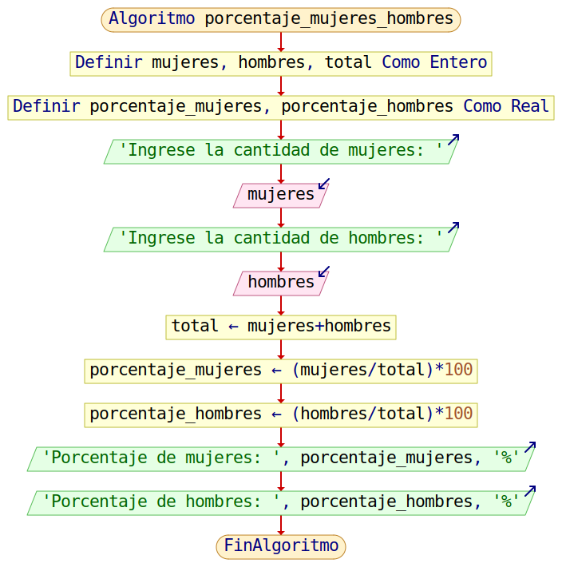

<div align="center">
<a href="../Unidad1" style="
    background: linear-gradient(90deg, #2E7D32, #66BB6A);
    color: white;
    padding: 12px 30px;
    text-decoration: none;
    font-size: 18px;
    font-weight: bold;
    border-radius: 10px;
    box-shadow: 0 4px 10px rgba(0,0,0,0.2);
    display: inline-block;
    margin-top: 20px;
">
⬅️ Volver al Índice
</a>
</div>

---

# 💻 Códigos en PSeInt

En esta sección se recopilan los programas desarrollados en **PSeInt**, con pseudocódigo, diagramas de flujo y tablas de prueba de escritorio.

---

## 🔹 1 — Volumen de una caja

**Archivo:** `volumen_caja.psc`  
**Descripción:** Calcula el volumen de una caja ingresando sus dimensiones A, B y C.  

**Pseudocódigo:**
```
Algoritmo volumen_caja

    Definir A, B, C, volumen Como Real;

    Escribir "Ingrese la dimension A: ";
    Leer A;
    Escribir "Ingrese la dimension B: ";
    Leer B;
    Escribir "Ingrese la dimension C: ";
    Leer C;

    volumen = A * B * C;

    Escribir "El volumen de la caja es: ", volumen;

FinAlgoritmo
```

**Diagrama de flujo:**  


**IMAGEN 4:** Diagrama de flujo del cálculo del volumen de una caja.  

  

**Descripción detallada del diagrama:**  
1. Inicio del algoritmo.  
2. Entrada de las dimensiones A, B y C.  
3. Cálculo del volumen multiplicando A*B*C.  
4. Mostrar el volumen.  
5. Fin del algoritmo.  
> Flujo secuencial lineal sin decisiones.

### 🧩 Tabla de prueba de escritorio


**TABLA 10:** Prueba de escritorio del cálculo del volumen de una caja. 

| **Caso** | **A** | **B** | **C** | **Proceso**          | **Salida**                 |
|-----------|-------|-------|-------|--------------------|----------------------------|
| 1         | 2     | 3     | 4     | 2*3*4 = 24         | 24                         |
| 2         | 5     | 5     | 5     | 5*5*5 = 125        | 125                        |
| 3         | 1.5   | 2     | 3     | 1.5*2*3 = 9        | 9                          |
| 4         | 0     | 10    | 2     | 0*10*2 = 0         | 0                          |

---

## 🔹 2 — Sueldo de un asesor

**Archivo:** `sueldo_asesor.psc`  
**Descripción:** Calcula el sueldo total de un asesor por 3 meses, ingresando el sueldo mensual.  

**Pseudocódigo:**
```
Algoritmo sueldo_asesor

    Definir sueldo_mensual, sueldo_total Como Real;

    Escribir "Ingrese el sueldo mensual del asesor: ";
    Leer sueldo_mensual;

    sueldo_total = sueldo_mensual * 3;

    Escribir "El sueldo total del asesor es: ", sueldo_total;
FinAlgoritmo
```

**Diagrama de flujo:**  


**IMAGEN 5:** Diagrama de flujo del cálculo del sueldo total de un asesor.

  

**Descripción detallada del diagrama:**  
1. Inicio del algoritmo.  
2. Entrada del sueldo mensual.  
3. Multiplicación por 3 para obtener el sueldo total.  
4. Mostrar sueldo total.  
5. Fin del algoritmo.  
> Flujo lineal, sin decisiones.

### 🧩 Tabla de prueba de escritorio


**TABLA 11:** Prueba de escritorio del cálculo del sueldo total de un asesor.

| **Caso** | **Sueldo Mensual** | **Proceso**          | **Salida**                   |
|-----------|------------------|--------------------|------------------------------|
| 1         | 500              | 500*3 = 1500       | 1500                         |
| 2         | 750.50           | 750.5*3 = 2251.5   | 2251.5                       |
| 3         | 0                | 0*3 = 0            | 0                            |
| 4         | 1200             | 1200*3 = 3600      | 3600                         |

---

## 🔹 3 — Cambio a recibir

**Archivo:** `cambio.psc`  
**Descripción:** Calcula el cambio que recibirá una persona según el dinero disponible y el precio del producto.  

**Pseudocódigo:**
```
Algoritmo cambio

    Definir dinero, precio, vuelto Como Real;

    Escribir "Ingrese el dinero que posee: ";
    Leer dinero;
    Escribir "Ingrese el precio del producto: ";
    Leer precio;

    vuelto = dinero - precio;

    Escribir "El cambio a recibir es: ", vuelto;
FinAlgoritmo
```

**Diagrama de flujo:**  


**IMAGEN 6:** Diagrama de flujo del cálculo del cambio a recibir.  

  

**Descripción detallada del diagrama:**  
1. Inicio.  
2. Entrada de dinero y precio.  
3. Resta dinero - precio para calcular cambio.  
4. Mostrar cambio.  
5. Fin del algoritmo.  
> Flujo lineal, se podría agregar decisión para verificar si dinero < precio.

### 🧩 Tabla de prueba de escritorio


**TABLA 12:** Prueba de escritorio del cálculo del cambio a recibir.  

| **Caso** | **Dinero** | **Precio** | **Proceso**        | **Salida**            |
|-----------|------------|------------|------------------|----------------------|
| 1         | 50         | 30         | 50-30 = 20       | 20                   |
| 2         | 100        | 45.5       | 100-45.5 = 54.5  | 54.5                 |
| 3         | 20         | 20         | 20-20 = 0        | 0                    |
| 4         | 10         | 15         | 10-15 = -5       | -5                   |

---

## 🔹 4 — Porcentaje de mujeres y hombres

**Archivo:** `porcentaje_mujeres_hombres.psc`  
**Descripción:** Calcula el porcentaje de mujeres y hombres dado la cantidad de cada categoría.  

**Pseudocódigo:**
```
Algoritmo porcentaje_mujeres_hombres

    Definir mujeres, hombres, total Como Entero;
    Definir porcentaje_mujeres, porcentaje_hombres Como Real;

    Escribir "Ingrese la cantidad de mujeres: ";
    Leer mujeres;
    Escribir "Ingrese la cantidad de hombres: ";
    Leer hombres;

    total = mujeres + hombres;
    porcentaje_mujeres = (mujeres / total) * 100;
    porcentaje_hombres = (hombres / total) * 100;

    Escribir "Porcentaje de mujeres: ", porcentaje_mujeres, "%";
    Escribir "Porcentaje de hombres: ", porcentaje_hombres, "%";
FinAlgoritmo
```

**Diagrama de flujo:**  


**IMAGEN 7:** Diagrama de flujo del cálculo del porcentaje de mujeres y hombres.  

  

**Descripción detallada del diagrama:**  
1. Inicio.  
2. Entrada de la cantidad de mujeres y hombres.  
3. Suma total = mujeres + hombres.  
4. Cálculo de porcentaje de mujeres = (mujeres / total)*100.  
5. Cálculo de porcentaje de hombres = (hombres / total)*100.  
6. Mostrar ambos porcentajes.  
7. Fin del algoritmo.  
> Flujo lineal con cálculos dependientes del total; se puede validar total ≠ 0 para evitar división entre cero.

### 🧩 Tabla de prueba de escritorio

**TABLA 13:** Prueba de escritorio del cálculo del porcentaje de mujeres y hombres.

| **Caso** | **Mujeres** | **Hombres** | **Total** | **% Mujeres** | **% Hombres** |
|-----------|--------------|--------------|------------|----------------|----------------|
| 1         | 20           | 20           | 40         | 50%             | 50%             |
| 2         | 30           | 10           | 40         | 75%             | 25%             |
| 3         | 15           | 25           | 40         | 37.5%           | 62.5%           |
| 4         | 0            | 10           | 10         | 0%              | 100%            |
| 5         | 12           | 0            | 12         | 100%            | 0%              |

---

<div align="center">

<a href="../Unidad1" style="
    background: linear-gradient(90deg, #2E7D32, #66BB6A);
    color: white;
    padding: 12px 30px;
    text-decoration: none;
    font-size: 18px;
    font-weight: bold;
    border-radius: 10px;
    box-shadow: 0 4px 10px rgba(0,0,0,0.2);
    display: inline-block;
    margin-top: 20px;
">
⬅️ Volver al Índice
</a>

</div>
