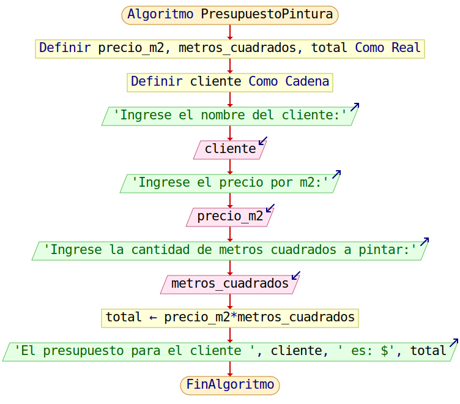

<div align="center">

<!-- Botón para volver a la Unidad 1 -->
<a href="../Unidad1" style="
    background: linear-gradient(90deg, #2E7D32, #66BB6A);
    color: white;
    padding: 12px 30px;
    text-decoration: none;
    font-size: 18px;
    font-weight: bold;
    border-radius: 10px;
    box-shadow: 0 4px 10px rgba(0,0,0,0.2);
    display: inline-block;
    margin-bottom: 20px;
">
⬅️ Volver
</a>

</div>

# 🧱 Clase 2 — Presentación Elementos básicos de algoritmos y programas

---

## 📄 Descripción

En esta clase vimos los conceptos fundamentales relacionados con los algoritmos y programas en programación.  
Puedes revisar la [presentación completa de la clase](https://drive.google.com/file/d/1HkqK8f4z72-7lD0R3cHGEqTIlHC1l3L1/view?usp=sharing) para más detalles.

Se explicó qué son los **datos** y la **información**, destacando que los datos son cifras, letras o palabras que la computadora procesa y almacena en formatos específicos.  

Se profundizó en los **tipos de datos simples**:

- **Enteros (int):** números sin parte decimal, positivos, negativos o cero.  
- **Reales (float o double):** números con punto decimal, positivos o negativos.  
- **Lógicos (boolean):** solo toman los valores `verdadero` o `falso`.  
- **Carácter (char):** un solo carácter, entre comillas.  
- **Cadena:** secuencias de caracteres agrupados, también entre comillas.  

Se abordaron **variables** (almacenan datos y siguen tipos y notaciones como Camel Case) y **constantes** (valores que no cambian durante la ejecución).  

Respecto a los elementos básicos de los algoritmos, vimos instrucciones de **control secuencial**:

```text
Asignación de valores
Lectura de datos
Escritura de datos
```

Se introdujeron las **expresiones** (aritméticas, lógicas y relacionales) y las **pruebas de escritorio**, útiles para verificar la lógica paso a paso.  

Se revisaron las **estructuras principales**: secuenciales, condicionales y ciclos, y los pasos para escribir algoritmos en pseudocódigo o diagramas de flujo, enfatizando analizar el problema, desarrollar el algoritmo y validar con pruebas.

---

## 🧩 Actividad

**Problema:**  
Un almacén requiere determinar cuánto cobrar por trabajos de pintura. Considere que se cobra por m². Realice el algoritmo que permita ir generando presupuestos para cada cliente.

**Ejemplo de pseudocódigo en PSeInt:**

> El algoritmo calcula el presupuesto total para un trabajo de pintura.  
Primero solicita el **nombre del cliente**, el **precio por metro cuadrado** y la **cantidad de metros cuadrados a pintar**.  
Luego multiplica el precio por la cantidad (`total ← precio_m2 * metros_cuadrados`) para obtener el **costo total del trabajo**.  
Finalmente, muestra en pantalla el nombre del cliente junto con el valor total del presupuesto.

```pseudocode
Algoritmo PresupuestoPintura
    Definir precio_m2, metros_cuadrados, total Como Real
    Definir cliente Como Cadena

    Escribir "Ingrese el nombre del cliente:"
    Leer cliente
    Escribir "Ingrese el precio por m2:"
    Leer precio_m2
    Escribir "Ingrese la cantidad de metros cuadrados a pintar:"
    Leer metros_cuadrados

    total <- precio_m2 * metros_cuadrados

    Escribir "El presupuesto para el cliente ", cliente, " es: $", total
FinAlgoritmo
```
**Prueba de escritoriot:**

| **Caso** | **Cliente** | **Precio por m² ($)** | **Metros cuadrados** | **Proceso**                               | **Salida**                                      |
|-----------|--------------|-----------------------|-----------------------|--------------------------------------------|------------------------------------------------|
| 1         | Ana          | 2.50                  | 100                   | total ← 2.50 × 100 = 250.00               | El presupuesto para el cliente Ana es: $250.00 |
| 2         | Luis         | 3.75                  | 80                    | total ← 3.75 × 80 = 300.00                | El presupuesto para el cliente Luis es: $300.00 |
| 3         | Marta        | 1.90                  | 120                   | total ← 1.90 × 120 = 228.00               | El presupuesto para el cliente Marta es: $228.00 |
| 4         | Pedro        | 4.00                  | 50                    | total ← 4.00 × 50 = 200.00                | El presupuesto para el cliente Pedro es: $200.00 |

**Terminal:**

```terminal
Ingrese el nombre del cliente:
> Juan Perez
Ingrese el precio por m2:
> 15
Ingrese la cantidad de metros cuadrados a pintar:
> 120
El presupuesto para el cliente Juan Perez es: $1800
```

**Diagrama de flujo:**

> Inicia con la **definición de las variables** `precio_m2`, `metros_cuadrados`, `total` (como Real) y `cliente` (como Cadena).
Luego **solicita** el nombre del cliente, el precio por m² y la cantidad de metros cuadrados a pintar.
Realiza la operación de cálculo: `total ← precio_m2 * metros_cuadrados`, y finalmente **muestra** el presupuesto completo en pantalla.
El proceso termina con el fin del algoritmo.




> Esta actividad permitió practicar el uso de variables, entradas/salidas y operaciones básicas en pseudocódigo para resolver problemas reales.

---

<div align="center" style="display: flex; justify-content: center; gap: 20px; flex-wrap: wrap; margin-bottom: 20px;">

<!-- Botón Clase anterior -->
<a href="./Clase1_Presentacion_Conceptos" style="
    background: linear-gradient(90deg, #F4511E, #FF7043);
    color: white;
    padding: 12px 25px;
    text-decoration: none;
    font-size: 16px;
    font-weight: bold;
    border-radius: 10px;
    box-shadow: 0 4px 10px rgba(0,0,0,0.2);
    display: inline-block;
">
⬅️ Clase 1
</a>

<!-- Botón Clase siguiente -->
<a href="./Clase3_Presentacion_Herramientas" style="
    background: linear-gradient(90deg, #1E88E5, #42A5F5);
    color: white;
    padding: 12px 25px;
    text-decoration: none;
    font-size: 16px;
    font-weight: bold;
    border-radius: 10px;
    box-shadow: 0 4px 10px rgba(0,0,0,0.2);
    display: inline-block;
">
Clase 3 ➡️
</a>

</div>

<div align="center">

<!-- Botón para volver a la Unidad 1 -->
<a href="../Unidad1" style="
    background: linear-gradient(90deg, #2E7D32, #66BB6A);
    color: white;
    padding: 12px 30px;
    text-decoration: none;
    font-size: 18px;
    font-weight: bold;
    border-radius: 10px;
    box-shadow: 0 4px 10px rgba(0,0,0,0.2);
    display: inline-block;
    margin-top: 20px;
">
⬅️ Volver
</a>

</div>

