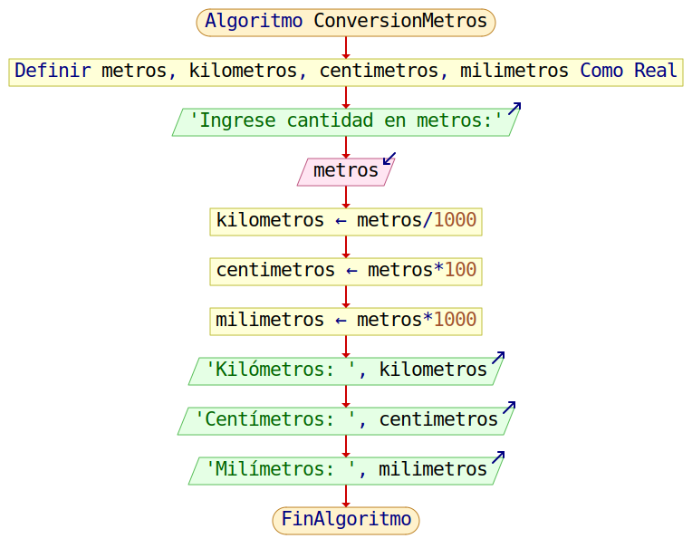

<div align="center">

<!-- Botón para volver a la Unidad 1 -->
<a href="../Unidad1" style="
    background: linear-gradient(90deg, #2E7D32, #66BB6A);
    color: white;
    padding: 12px 30px;
    text-decoration: none;
    font-size: 18px;
    font-weight: bold;
    border-radius: 10px;
    box-shadow: 0 4px 10px rgba(0,0,0,0.2);
    display: inline-block;
    margin-bottom: 20px;
">
⬅️ Volver
</a>

</div>

# 💻 Clase 4 — Programación en Lenguaje C

---

## 📄 Descripción

En esta clase vimos la introducción a la programación en C, su relación con algoritmos y pseudocódigo, y la importancia de las buenas prácticas en la codificación.

Se abordaron los siguientes conceptos:

1. **Introducción a C**: Lenguaje fundamental para aprender programación. Transformación de algoritmos en código ejecutable.

2. **Algoritmo y Pseudocódigo**: Secuencia lógica de pasos para resolver problemas antes de codificar.

```pseudocode
Inicio
    Leer largo
    Leer ancho
    area <- largo * ancho
    Mostrar area
Fin
```

3. **Uso de librerías en C**: Funciones predefinidas para entrada/salida y operaciones matemáticas. Librería estándar `stdio.h`.

```c
#include <stdio.h>

int main() {
    int numero;
    printf("Ingrese un número: ");
    scanf("%d", &numero);
    printf("El número ingresado es %d\n", numero);
    return 0;
}
```

4. **Función principal main()**: Punto de entrada de todo programa en C.

```c
int main() {
    // Código de inicio
    return 0;
}
```

5. **Comentarios en C**:

```c
// Comentario de línea
/* Comentario
   de varias líneas */
```

6. **Palabras reservadas y declaración de variables**:

```c
int a, b;
float promedio;
char respuesta = 'S';
char nombre[20] = "Juan";
```

7. **Entrada y salida de datos**:

```c
int edad;
printf("Ingrese su edad: ");
scanf("%d", &edad);
printf("Tu edad es %d\n", edad);
```

8. **Cálculos y operaciones aritméticas**:

```c
int suma = a + b;
float resultado = (float) numerator / denominator;
```

---

## 🧩 Actividad

**Ejercicio práctico:**  
Realizar un programa que, tomando una cantidad expresada en metros, la transforme a kilómetros, centímetros y milímetros.

> El programa solicita al usuario una cantidad en **metros** y realiza su conversión a **kilómetros**, **centímetros** y **milímetros**.  
Para ello, aplica las siguientes fórmulas:
- `kilometros = metros / 1000`
- `centimetros = metros * 100`
- `milimetros = metros * 1000`
Finalmente, muestra los resultados en pantalla con dos decimales de precisión.

**PSeInt:** 
```pseudocode
Algoritmo ConversionMetros
    Definir metros, kilometros, centimetros, milimetros Como Real;

    Escribir "Ingrese cantidad en metros:";
    Leer metros;

    kilometros = metros / 1000;
    centimetros = metros * 100;
    milimetros = metros * 1000;

    Escribir "Kilómetros: ", kilometros;
    Escribir "Centímetros: ", centimetros;
    Escribir "Milímetros: ", milimetros;
FinAlgoritmo
```

**C:** 

```c
#include <stdio.h>

int main() {
    float metros, kilometros, centimetros, milimetros;

    printf("Ingrese cantidad en metros: ");
    scanf("%f", &metros);

    kilometros = metros / 1000;
    centimetros = metros * 100;
    milimetros = metros * 1000;

    printf("Kilómetros: %.2f\n", kilometros);
    printf("Centímetros: %.2f\n", centimetros);
    printf("Milímetros: %.2f\n", milimetros);

    return 0;
}
```

**Tabla de prueba de escritorio**

| **Caso** | **Entrada (metros)** | **Proceso**                                           | **Salida**                                                                 |
|-----------|----------------------|--------------------------------------------------------|----------------------------------------------------------------------------|
| 1         | 1                    | km = 1 / 1000 = 0.001<br>cm = 1 * 100 = 100<br>mm = 1 * 1000 = 1000 | Kilómetros: 0.001<br>Centímetros: 100<br>Milímetros: 1000                 |
| 2         | 5.5                  | km = 5.5 / 1000 = 0.0055<br>cm = 5.5 * 100 = 550<br>mm = 5.5 * 1000 = 5500 | Kilómetros: 0.0055<br>Centímetros: 550<br>Milímetros: 5500               |
| 3         | 10                   | km = 10 / 1000 = 0.01<br>cm = 10 * 100 = 1000<br>mm = 10 * 1000 = 10000 | Kilómetros: 0.01<br>Centímetros: 1000<br>Milímetros: 10000               |
| 4         | 0.25                 | km = 0.25 / 1000 = 0.00025<br>cm = 0.25 * 100 = 25<br>mm = 0.25 * 1000 = 250 | Kilómetros: 0.00025<br>Centímetros: 25<br>Milímetros: 250                |
| 5         | 150                  | km = 150 / 1000 = 0.15<br>cm = 150 * 100 = 15000<br>mm = 150 * 1000 = 150000 | Kilómetros: 0.15<br>Centímetros: 15000<br>Milímetros: 150000             |


```terminal
Ingrese cantidad en metros:
> 150
Kilómetros: 0.15
Centímetros: 15000.00
Milímetros: 150000.00
```

**Diagrama de flujo:**

> Inicia con la **definición de las variables** `metros`, `kilometros`, `centimetros` y `milimetros` (todas como Real).
Luego **solicita** al usuario que ingrese la cantidad en metros, y almacena el valor en la variable `metros`.
A continuación, realiza las siguientes operaciones de conversión:
* `kilometros ← metros / 1000`
* `centimetros ← metros * 100`
* `milimetros ← metros * 1000`

> Finalmente, **muestra** en pantalla los tres resultados calculados: los Kilómetros, los Centímetros y los Milímetros.
El proceso termina con el fin del algoritmo.



> Esta actividad permite practicar entrada/salida de datos, conversiones y operaciones aritméticas en C.

---

<div align="center" style="display: flex; justify-content: center; gap: 20px; flex-wrap: wrap; margin-bottom: 20px;">

<!-- Botón Clase anterior -->
<a href="./Clase3_Presentacion_Herramientas" style="
    background: linear-gradient(90deg, #F4511E, #FF7043);
    color: white;
    padding: 12px 25px;
    text-decoration: none;
    font-size: 16px;
    font-weight: bold;
    border-radius: 10px;
    box-shadow: 0 4px 10px rgba(0,0,0,0.2);
    display: inline-block;
">
⬅️ Clase 3
</a>

</div>

<div align="center">

<!-- Botón para volver a la Unidad 1 -->
<a href="../Unidad1" style="
    background: linear-gradient(90deg, #2E7D32, #66BB6A);
    color: white;
    padding: 12px 30px;
    text-decoration: none;
    font-size: 18px;
    font-weight: bold;
    border-radius: 10px;
    box-shadow: 0 4px 10px rgba(0,0,0,0.2);
    display: inline-block;
    margin-top: 20px;
">
⬅️ Volver
</a>

</div>

