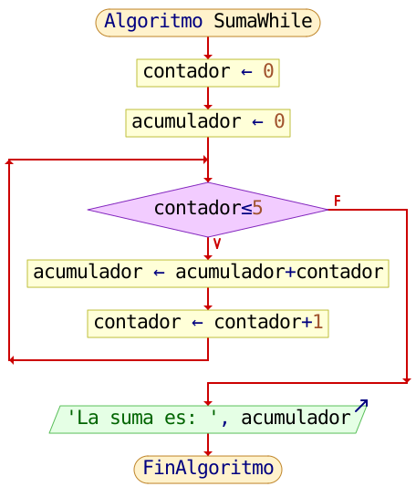
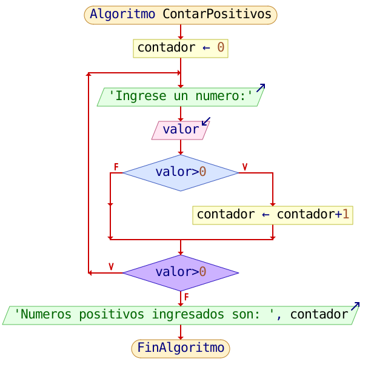
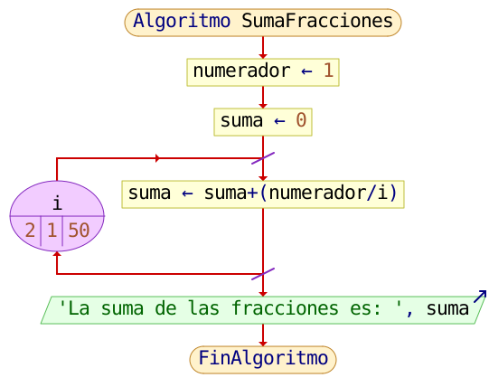
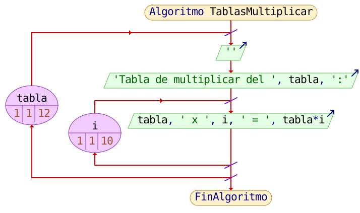
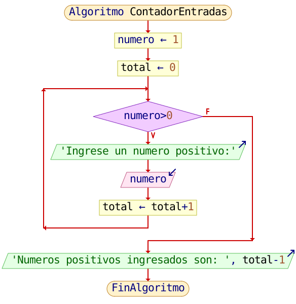
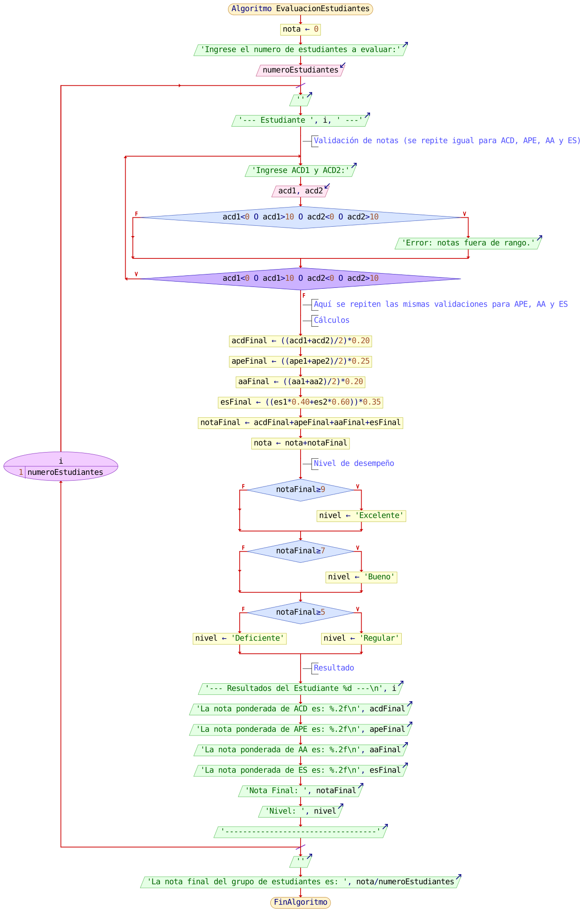

<div align="center">
<a href="../Unidad2" style="
    background: linear-gradient(90deg, #2E7D32, #66BB6A);
    color: white;
    padding: 12px 30px;
    text-decoration: none;
    font-size: 18px;
    font-weight: bold;
    border-radius: 10px;
    box-shadow: 0 4px 10px rgba(0,0,0,0.2);
    display: inline-block;
    margin-top: 20px;
">
⬅️ Volver a Unidad 2
</a>
</div>

---

# 💻 Códigos en Lenguaje C — Unidad 2

En esta sección se presentan programas desarrollados en **lenguaje C** aplicando las estructuras repetitivas vistas en los recursos de esta unidad.  
A continuación cada bloque incluye un **placeholder para el diagrama de flujo** (ruta SVG) y el código en C.

No incluyen pruebas de escritorio (según lo solicitado).

---

## 🔹 1 — Suma acumulada con ciclo *while*

**Archivo:** `suma_while.c`  
**Descripción:** Suma los números del 0 al 5 utilizando un ciclo `while`. Cada valor se acumula en la variable `acumulador`.

### 🖼️ Diagrama de flujo


**Código:**
```c
#include <stdio.h>

int main() {
    int contador = 0, acumulador = 0;

    while (contador <= 5) 
    {
        acumulador = acumulador + contador;
        contador++;
    }

    printf("La suma es: %i\n", acumulador);
    
    return 0;
}
```

---

## 🔹 2 — Contador de números positivos (*do–while*)

**Archivo:** `contar_positivos.c`  
**Descripción:** Solicita números al usuario y cuenta cuántos valores positivos se ingresaron.  
El ciclo termina cuando se introduce un número negativo o cero.

### 🖼️ Diagrama de flujo


**Código:**
```c
#include <stdio.h>

int main() {

    int valor = 0, contador = 0;

    do
    {
        printf("Ingrese un numero:\n");
        scanf("%i", &valor);
        getchar();

        if (valor > 0)
        {
            contador = contador + 1;
        }

    } while (valor > 0);
    
    printf("Numeros positivos ingresados son: %i\n", contador);
    return 0;   
}
```

---

## 🔹 3 — Suma de fracciones con ciclo *for*

**Archivo:** `suma_fracciones.c`  
**Descripción:** Calcula la suma de la serie  
\[
\frac{1}{2} + \frac{1}{3} + \frac{1}{4} + \dots + \frac{1}{50}
\]  
utilizando un bucle `for`.

### 🖼️ Diagrama de flujo


**Código:**
```c
#include <stdio.h>

int main() {

    float i, numerador = 1, suma = 0;

    for (i = 2; i <= 50; i++)
    {
        suma = suma + (numerador / i);
    }

    printf("La suma de las fracciones es: %.2f\n", suma);

    return 0;
}
```

---

## 🔹 4 — Tablas de multiplicar del 1 al 12

**Archivo:** `tablas_multiplicar.c`  
**Descripción:** Muestra las tablas de multiplicar del **1 al 12**, cada una del 1 al 10.

### 🖼️ Diagrama de flujo


**Código:**
```c
#include <stdio.h>

int main() {

    int tabla = 1, i = 1;

    for (tabla = 1; tabla <= 12; tabla++)
    {
        printf("\nTabla de multiplicar del %i:\n", tabla);
        
        for (i = 1; i <= 10; i++)
        {
            printf("%i x %i = %i\n", tabla, i, tabla * i);
        }
    }
    
    return 0;    
}
```

---

## 🔹 5 — Contador de entradas positivas (*while*)

**Archivo:** `contador_entradas.c`  
**Descripción:** Cuenta cuántos números positivos ingresa el usuario.  
El ciclo termina cuando se introduce un número negativo o cero.

### 🖼️ Diagrama de flujo


**Código:**
```c
#include <stdio.h>

int main() {

    int numero = 1, total = 0;

    while (numero > 0)
    {
        printf("Ingrese un numero positivo:\n");
        scanf("%i", &numero);
        getchar();

        total = total + 1;
    }

    printf("Numeros positivos ingresados son: %i\n", total - 1);

    return 0;
}
```

---

## 🔹 6 — Evaluación de estudiantes (validación y ponderación)  

**Archivo:** `evaluacion_estudiantes.c`  
**Descripción:** Lee las notas (ACD, APE, AA, ES) de N estudiantes, valida que cada nota esté entre 0 y 10, calcula las ponderaciones por componente, determina la nota final por estudiante y su nivel de desempeño, y finalmente muestra el promedio del grupo.

### 🖼️ Diagrama de flujo


**Código:**
```c
#include <stdio.h>

int main()
{
    // Definición de variables
    int i = 1, numeroEstudiantes;
    float acd1, acd2, acdFinal, ape1, ape2, apeFinal, aa1, aa2, aaFinal, es1, es2, esFinal, notaFinal;
    float nota = 0.0;
    char *nivelDesempeno;

    // Datos de entrada
    printf("Ingrese el numero de estudiantes a evaluar: ");
    scanf("%d", &numeroEstudiantes);

    printf("\nLas notas deben de ser ingresadas en una escala de 0 a 10.\n");
    printf("Ejemplo de ingreso de nota: 9 10\n");

    for (i = 1; i <= numeroEstudiantes; i++)
    {

        printf("\n--- Estudiante %d ---\n", i);
        do
        {
            printf("Ingrese las notas del ACD 1 Y ACD 2:\n");
            scanf("%f %f", &acd1, &acd2);
            getchar();

            if (acd1 < 0 || acd1 > 10 || acd2 < 0 || acd2 > 10)
            {
                printf("Error: Las notas deben estar entre 0 y 10. Por favor, ingrese nuevamente.\n");
            }
        } while (acd1 < 0 || acd1 > 10 || acd2 < 0 || acd2 > 10);

        do
        {
            printf("Ingrese las notas del APE 1 Y APE 2:\n");
            scanf("%f %f", &ape1, &ape2);
            getchar();

            if (ape1 < 0 || ape1 > 10 || ape2 < 0 || ape2 > 10)
            {
                printf("Error: Las notas deben estar entre 0 y 10. Por favor, ingrese nuevamente.\n");
            }
        } while (ape1 < 0 || ape1 > 10 || ape2 < 0 || ape2 > 10);

        do
        {
            printf("Ingrese las notas del AA 1 Y AA 2:\n");
            scanf("%f %f", &aa1, &aa2);
            getchar();

            if (aa1 < 0 || aa1 > 10 || aa2 < 0 || aa2 > 10)
            {
                printf("Error: Las notas deben estar entre 0 y 10. Por favor, ingrese nuevamente.\n");
            }
        } while (aa1 < 0 || aa1 > 10 || aa2 < 0 || aa2 > 10);

        do
        {
            printf("Ingrese las notas del ES 1 Y ES 2:\n");
            scanf("%f %f", &es1, &es2);
            getchar();

            if (es1 < 0 || es1 > 10 || es2 < 0 || es2 > 10)
            {
                printf("Error: Las notas deben estar entre 0 y 10. Por favor, ingrese nuevamente.\n");
            }
        } while (es1 < 0 || es1 > 10 || es2 < 0 || es2 > 10);

        // Proceso

        // ACD ponderado de 2 puntos (20%)
        acdFinal = (acd1 + acd2) / 2.0f;
        acdFinal = acdFinal * 0.20f;

        // APE ponderado de 2.5 puntos (25%)
        apeFinal = (ape1 + ape2) / 2.0f;
        apeFinal = apeFinal * 0.25f;

        // AA ponderado de 2 puntos (20%)
        aaFinal = (aa1 + aa2) / 2.0f;
        aaFinal = aaFinal * 0.20f;

        // ES ponderado de 3.5 (35%)
        esFinal = (es1 * 0.40f + es2 * 0.60f);
        esFinal = esFinal * 0.35f;

        // Nota final de la unidad 1
        notaFinal = acdFinal + apeFinal + aaFinal + esFinal;
        nota += notaFinal;

        // Nivel de desempeño del promedio de la unidad 1
        if (notaFinal >= 9.0f)
        {
            nivelDesempeno = "Excelente";
        }
        else if (notaFinal >= 7.0f && notaFinal < 9.0f)
        {
            nivelDesempeno = "Bueno";
        }
        else if (notaFinal >= 5.0f && notaFinal < 7.0f)
        {
            nivelDesempeno = "Regular";
        }
        else if (notaFinal < 5.0f)
        {
            nivelDesempeno = "Deficiente";
        }
        else
        {
            nivelDesempeno = "Error";
        }

        // Datos de salida
        printf("--- Resultados del Estudiante %d ---\n", i);
        printf("La nota ponderada de ACD es: %.2f\n", acdFinal);
        printf("La nota ponderada de APE es: %.2f\n", apeFinal);
        printf("La nota ponderada de AA es: %.2f\n", aaFinal);
        printf("La nota ponderada de ES es: %.2f\n", esFinal);
        printf("La nota final de la Unidad 1 es: %.2f\n", notaFinal);
        printf("El nivel de desempeno es: %s\n", nivelDesempeno);
        printf("\n------------------------------------\n");
    }

    printf("\nLa nota final del grupo de estudiantes es: %.2f\n", nota / numeroEstudiantes);
    return 0;
}
```

---

<div align="center">
<a href="../Unidad2" style="
    background: linear-gradient(90deg, #2E7D32, #66BB6A);
    color: white;
    padding: 12px 30px;
    text-decoration: none;
    font-size: 18px;
    font-weight: bold;
    border-radius: 10px;
    box-shadow: 0 4px 10px rgba(0,0,0,0.2);
    display: inline-block;
    margin-top: 20px;
">
⬅️ Volver a Unidad 2
</a>
</div>
