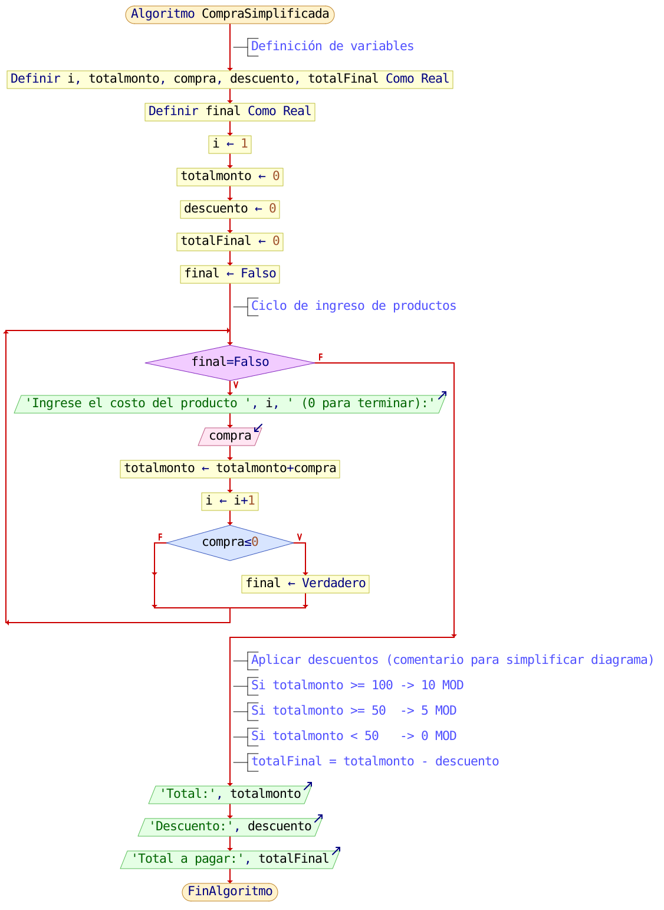
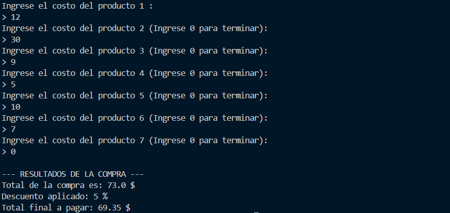

<div align="center">
<a href="../Unidad2" style="
    background: linear-gradient(90deg, #2E7D32, #66BB6A);
    color: white;
    padding: 12px 30px;
    text-decoration: none;
    font-size: 18px;
    font-weight: bold;
    border-radius: 10px;
    box-shadow: 0 4px 10px rgba(0,0,0,0.2);
    display: inline-block;
    margin-top: 20px;
">
⬅️ Volver a Unidad 2
</a>
</div>

---

# 💻 Ejercicio Combinado: Estructura Condicional + Repetitiva  
**Lenguaje:** Python  
**Tema:** Registro de compras con descuento automático

---

## 📝 Descripción del problema

Un supermercado necesita un programa que registre el monto de varios productos comprados por un cliente.  
El sistema permite ingresar cada precio hasta que el usuario escriba **0**, lo cual finaliza el registro.

Al terminar, se debe aplicar un descuento según el total:

- Si el total es **≥ 100** → 10% de descuento  
- Si el total está entre **50 y 99.99** → 5% de descuento  
- Si el total es **< 50** → sin descuento

El programa debe mostrar:

- Total antes del descuento  
- Porcentaje aplicado  
- Total final a pagar  

Este ejercicio combina:

✔ **Repetición** (pedir precios uno por uno)  
✔ **Condicionales** (aplicar el descuento según el total)

---

## 🖼️ Diagrama de flujo simplificado

*(Aquí se colocará la imagen del diagrama cuando esté listo)*



---

## 🧠 Programa en Python

```python
# Definicion de variables
i = 1
totalmonto = 0
compra = 0
totalFinal = 0
descuento = 0
final = False

# Proceso

while final == False:

    if totalmonto == 0:
        print("Ingrese el costo del producto", i, ":")
    else:
        print("Ingrese el costo del producto", i, "(Ingrese 0 para terminar):")

    compra = float(input("> "))

    totalmonto += compra
    i += 1

    if compra <= 0:
        final = True


if totalmonto >= 100:
    descuento = 10
    totalFinal = totalmonto * 0.90

elif totalmonto >= 50:
    descuento = 5
    totalFinal = totalmonto * 0.95

else:
    descuento = 0
    totalFinal = totalmonto


# Salida
print("\n--- RESULTADOS DE LA COMPRA ---")
print("Total de la compra es:", totalmonto, "$")
print("Descuento aplicado:", descuento, "%")
print(f"Total final a pagar: {totalFinal:.2f} $")

```
---

## 🔍 Verificación del funcionamiento



---

<div align="center">

<a href="../Unidad2" style="
    background: linear-gradient(90deg, #2E7D32, #66BB6A);
    color: white;
    padding: 12px 30px;
    text-decoration: none;
    font-size: 18px;
    font-weight: bold;
    border-radius: 10px;
    box-shadow: 0 4px 10px rgba(0,0,0,0.2);
    display: inline-block;
    margin-top: 20px;
">
⬅️ Volver al Índice
</a>

</div>
