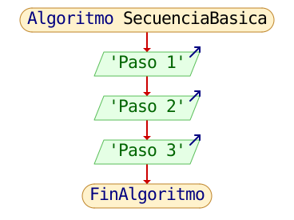
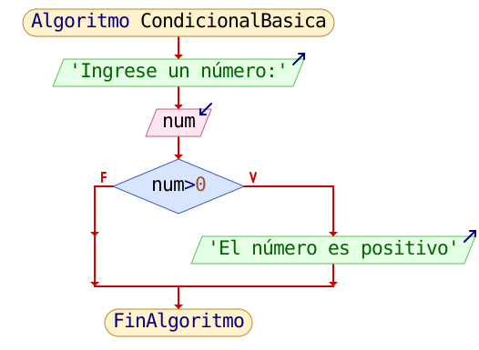
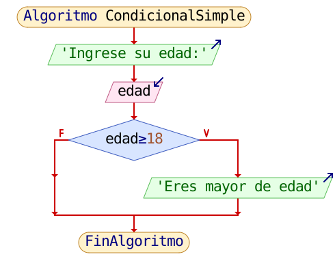
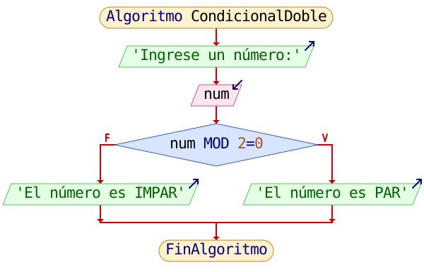
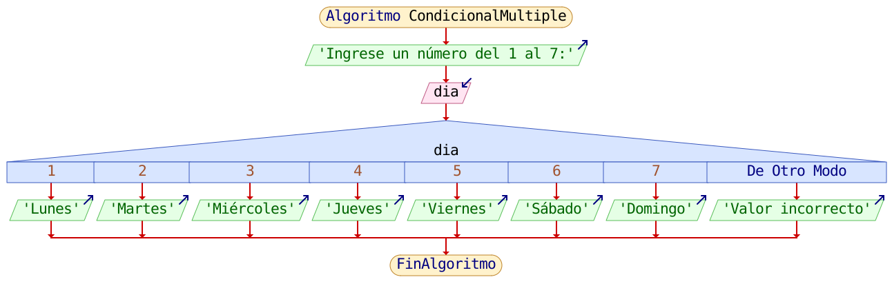
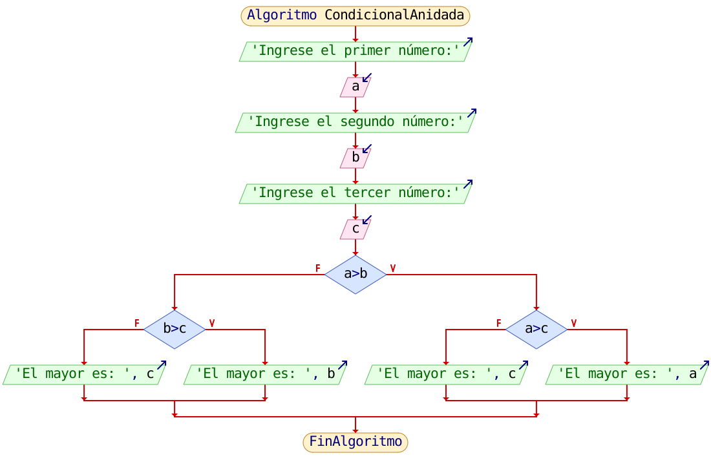
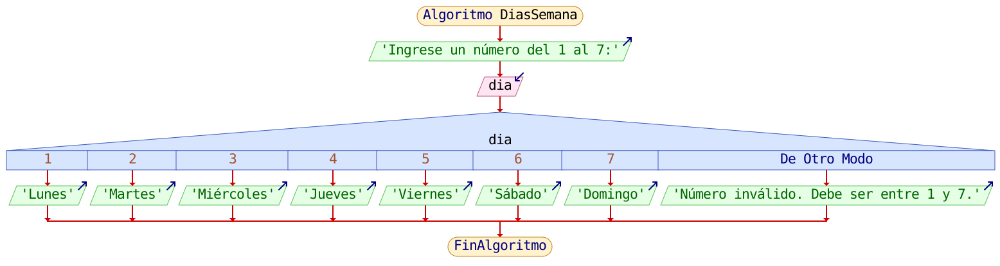

<div align="center">

<!-- Botón para volver a la Unidad 2 -->
<a href="../Unidad2" style="
    background: linear-gradient(90deg, #2E7D32, #66BB6A);
    color: white;
    padding: 12px 30px;
    text-decoration: none;
    font-size: 18px;
    font-weight: bold;
    border-radius: 10px;
    box-shadow: 0 4px 10px rgba(0,0,0,0.2);
    display: inline-block;
    margin-bottom: 20px;
">
⬅️ Volver
</a>

</div>

# 🧮 Recurso 1 — **Estructuras Algorítmicas Condicionales**

---

## 📄 Descripción

En este recurso estudiamos las **estructuras algorítmicas condicionales** y cómo permiten que un programa tome decisiones basadas en condiciones lógicas.  
Se explican sus tipos, el uso correcto en diagramas de flujo y la forma de implementarlas en código C.

Puedes revisar la **presentación completa del recurso** en el siguiente enlace:

👉 [Presentación del recurso](https://drive.google.com/file/d/1oqoenH8GQfUIZVsjjh2g4x0TMx3YGkm9/view?usp=sharing)

---

## 🔹 1. Estructuras de Control

Las **estructuras de control** permiten organizar y dirigir el flujo de un programa. Sin ellas, todas las instrucciones se ejecutarían de arriba hacia abajo sin ningún tipo de decisión o repetición.

Las estructuras principales son:

- **Secuenciales:** instrucciones que se ejecutan en orden.
- **Selectivas (Condicionales):** permiten tomar decisiones.
- **Repetitivas:** permiten repetir acciones mientras se cumpla una condición.

---
### 🖼️ Diagrama de flujo




---
### 📌 Implementación en C
```c
#include <stdio.h>
int main(){
    // Secuencia básica
    instruccion_1;
    instruccion_2;
    instruccion_3;
}
```

---

## 🔹 2. Estructuras Algorítmicas Condicionales

Las **estructuras condicionales** permiten elegir entre dos o más caminos dependiendo del resultado de una condición lógica.

Una **condición** siempre se evalúa como verdadera (true) o falsa (false).

Ejemplos de condiciones:
- a > b
- edad >= 18
- x != 0

---
### 🖼️ Diagrama de flujo




---
### 📌 Implementación en C
```c
if (condicion) {
    // instrucciones si la condición es verdadera
}
```

---

## 🔹 3. Condicional Simple — *Si*

La condicional simple se ejecuta solo cuando la condición es verdadera.  
Si es falsa, el bloque simplemente se ignora.

---
### 🖼️ Diagrama de flujo




---
### 📌 Implementación en C
```c
if (condicion) {
    // bloque si es verdadero
}
```

---

## 🔹 4. Condicional Doble — *Si ... Entonces*

Permite elegir entre dos caminos: uno cuando la condición es verdadera y otro cuando es falsa.

---
### 🖼️ Diagrama de flujo




---
### 📌 Implementación en C
```c
if (condicion) {
    // bloque si es verdadero
} else {
    // bloque si es falso
}
```

---

## 🔹 5. Condicional Múltiple — *Según / Switch*

Se usa cuando existen muchas opciones posibles.  
El programa ejecutará únicamente el caso que coincida con la variable evaluada.

---
### 🖼️ Diagrama de flujo




---
### 📌 Implementación en C
```c
switch(variable) {
    case valor1:
        // instrucciones
        break;
    case valor2:
        // instrucciones
        break;
    ...
    default:
        // si no coincide ningún caso
}
```

---

## 🔹 6. Anidamiento de Condicionales

Es cuando colocamos una estructura condicional **dentro de otra**.  
Esto permite resolver problemas más complejos.

Ejemplo típico: determinar el mayor de tres números.

---
### 🖼️ Diagrama de flujo




---
### 📌 Implementación en C
```c
if (condicion1) {
    if (condicion2) {
        // instrucciones
    }
}
```

---

## 🔹 7. Ejemplo con Condicional Múltiple (Selección entre varias opciones)


La estructura condicional múltiple permite tomar una decisión entre **diversas alternativas**. Se usa cuando un valor puede representar varios casos diferentes.


Es útil para:
- Elegir una opción según un número introducido.
- Mostrar mensajes según categorías.
- Ejecutar procesos distintos según el valor de una variable.


### 🔸 Diagrama de flujo





---


### 🔸 Ejemplo en C


```c
#include <stdio.h>

int main()
{
    int dia;
    printf("Ingrese un número del 1 al 7: ");
    scanf("%d", &dia);

    switch (dia)
    {
    case 1:
        printf("Lunes");
        break;
    case 2:
        printf("Martes");
        break;
    case 3:
        printf("Miércoles");
        break;
    case 4:
        printf("Jueves");
        break;
    case 5:
        printf("Viernes");
        break;
    case 6:
        printf("Sábado");
        break;
    case 7:
        printf("Domingo");
        break;
    default:
        printf("Número inválido. Debe ser entre 1 y 7.");
    }

    return 0;
}
```


---


### 🔸 Explicación del ejemplo
- El usuario ingresa un número del **1 al 7**.
- Cada *case* representa un día de la semana.
- `default` se ejecuta si el valor no coincide con ningún caso.
- `break` evita que el programa siga ejecutando los demás casos.


> Esta estructura es ideal para evitar múltiples `if-else` y organizar decisiones con varias opciones.

---

<div align="center" style="display: flex; justify-content: center; gap: 20px; flex-wrap: wrap; margin-bottom: 20px;">

<!-- Botón Recurso  siguiente -->
<a href="./Recurso2" style="
    background: linear-gradient(90deg, #1E88E5, #42A5F5);
    color: white;
    padding: 12px 25px;
    text-decoration: none;
    font-size: 16px;
    font-weight: bold;
    border-radius: 10px;
    box-shadow: 0 4px 10px rgba(0,0,0,0.2);
    display: inline-block;
">
Recurso 2 ➡️
</a>

</div>

<div align="center">
<!-- Botón para volver a la Unidad 2 -->
<a href="../Unidad2" style="
    background: linear-gradient(90deg, #2E7D32, #66BB6A);
    color: white;
    padding: 12px 30px;
    text-decoration: none;
    font-size: 18px;
    font-weight: bold;
    border-radius: 10px;
    box-shadow: 0 4px 10px rgba(0,0,0,0.2);
    display: inline-block;
    margin-top: 20px;
">
⬅️ Volver
</a>
</div>
