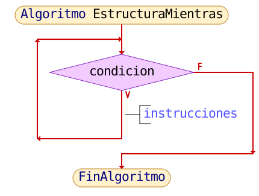
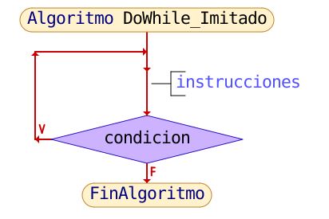
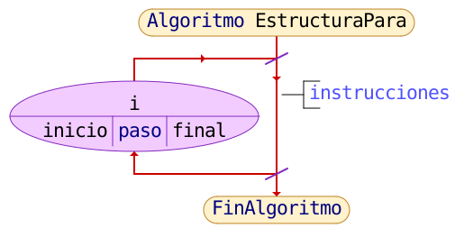
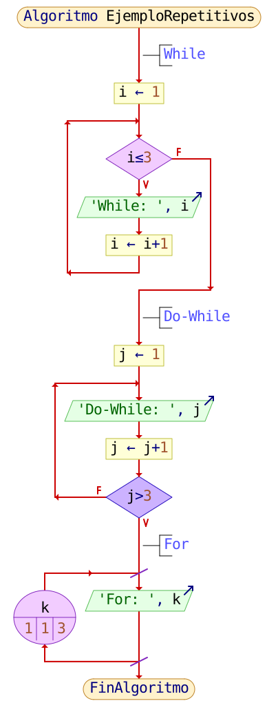

<div align="center">

<!-- Botón para volver a la Unidad 2 -->
<a href="../Unidad2" style="
    background: linear-gradient(90deg, #2E7D32, #66BB6A);
    color: white;
    padding: 12px 30px;
    text-decoration: none;
    font-size: 18px;
    font-weight: bold;
    border-radius: 10px;
    box-shadow: 0 4px 10px rgba(0,0,0,0.2);
    display: inline-block;
    margin-bottom: 20px;
">
⬅️ Volver
</a>

</div>

# 🧮 Recurso 4 — **Estructuras Algorítmicas Repetitivas**

---

## 📄 Descripción

En este recurso estudiamos las **estructuras repetitivas**, también llamadas **bucles**, que permiten ejecutar un conjunto de instrucciones varias veces mientras se cumpla una condición lógica.

Este tema forma parte de los fundamentos de la programación estructurada y permite automatizar tareas repetitivas, optimizar procesos y reducir errores humanos.

Puedes revisar la **presentación completa del recurso** en el siguiente enlace:

👉 *(Aquí irá tu enlace a la presentación del Recurso 4)*

---

# 🔹 1. ¿Qué son las estructuras repetitivas?

Las **estructuras algorítmicas repetitivas** permiten ejecutar un bloque de instrucciones varias veces.  
Se usan cuando un proceso debe repetirse sin necesidad de escribir el código muchas veces.

Existen tres tipos principales:

- **Mientras (while)** → Repite mientras la condición sea verdadera.  
- **Hacer…Mientras (do–while)** → Ejecuta al menos una vez.  
- **Para (for)** → Repite un número definido de veces.

---

# 🔹 2. Estructura Repetitiva *Mientras*

La estructura **mientras** evalúa una condición.  
Si es verdadera, ejecuta el bloque de instrucciones.  
Si es falsa, el ciclo termina.

Se usa cuando **no sabemos cuántas veces** se repetirá el proceso.

---

## 🖼️ Diagrama de flujo



---

## 📌 Implementación en C
```c
while (condicion) {
    // instrucciones
}
```

---

# 🔹 3. Estructura Repetitiva *Hacer…Mientras*

Esta estructura garantiza que el bloque de instrucciones se ejecuta **al menos una vez**, porque la condición se evalúa al final.

---

## 🖼️ Diagrama de flujo



---

## 📌 Implementación en C
```c
do {
    // instrucciones
} while (condicion);
```

---

# 🔹 4. Estructura Repetitiva *Para (for)*

Se utiliza cuando el número de repeticiones está **determinado**.

---

## 🖼️ Diagrama de flujo



---

## 📌 Implementación en C
```c
for (inicial; condicion; incremento) {
    // instrucciones
}
```

---

# 🔹 5. Ejemplo práctico — Uso de las tres estructuras

Este ejemplo muestra cómo se aplica cada tipo de ciclo en un caso real:

---

## 🖼️ Diagrama de flujo — Ejemplo general



---

## 📌 Ejemplo en C
```c
#include <stdio.h>

int main() {
    int i = 1;

    // Ejemplo con while
    while (i <= 3) {
        printf("While: %d\n", i);
        i++;
    }

    // Ejemplo con do-while
    int j = 1;
    do {
        printf("Do-While: %d\n", j);
        j++;
    } while (j <= 3);

    // Ejemplo con for
    for (int k = 1; k <= 3; k++) {
        printf("For: %d\n", k);
    }

    return 0;
}
```

---

## 🔸 Explicación del ejemplo

- `while` repite **mientras** la condición sea verdadera.  
- `do-while` **siempre ejecuta al menos una vez**.  
- `for` repite un número definido de veces.

---

<div align="center" style="display: flex; justify-content: center; gap: 20px; flex-wrap: wrap; margin-bottom: 20px;">

<!-- Botón Recurso anterior -->
<a href="./Recurso3" style="
    background: linear-gradient(90deg, #F4511E, #FF7043);
    color: white;
    padding: 12px 25px;
    text-decoration: none;
    font-size: 16px;
    font-weight: bold;
    border-radius: 10px;
    box-shadow: 0 4px 10px rgba(0,0,0,0.2);
    display: inline-block;
">
⬅️ Recurso 3
</a>

</div>

<div align="center">

<!-- Botón para volver -->
<a href="../Unidad2" style="
    background: linear-gradient(90deg, #2E7D32, #66BB6A);
    color: white;
    padding: 12px 30px;
    text-decoration: none;
    font-size: 18px;
    font-weight: bold;
    border-radius: 10px;
    box-shadow: 0 4px 10px rgba(0,0,0,0.2);
    display: inline-block;
    margin-top: 20px;
">
⬅️ Volver
</a>

</div>
